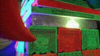
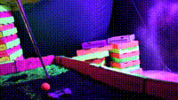
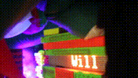

# GolfZilla
Arduino code for the immersive art exhibit Golfzilla. This project featured a 128-neopixel wraparound LED display that displayed an artists' image.
Patrons played a hold of miniature golf and a laser time-of-flight sensor detected when the ball went in the hole. This triggered a relay that
released a solenoid and opened a secret door. Players then spent time in a secret room while a timer on the LED display counted down a customizable
duration of time.

# Nothing Cheezy
[Nothing Cheezy](https://thinktank.gallery/nothingcheezyartists) was an immersive art exhibit in LA put on by Think Tank Gallery featuring a variety of artists.

# Hardware

# Media from the Show
128 Neopixel Array  
  

Time of Flight sensor triggering door  

  

Timer  

  

